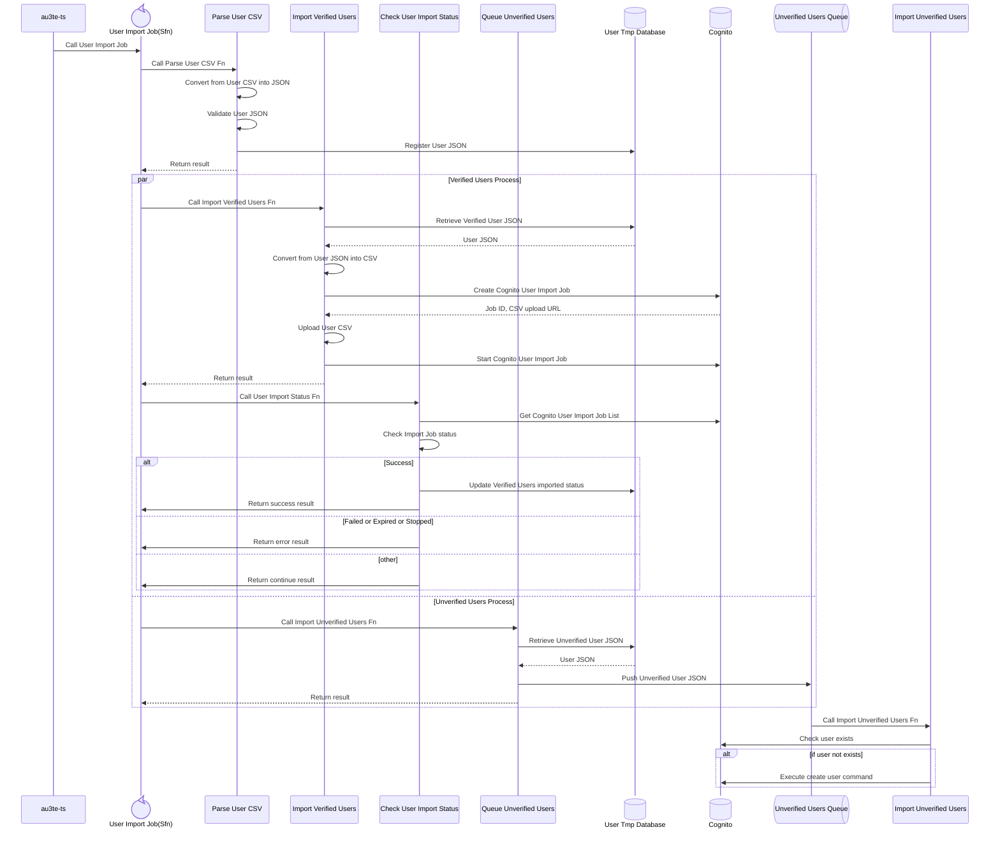

# Cognito user import functions

Package for bulk user import workflows into Amazon Cognito.

## AWS services

- **AWS Lambda** — CSV parsing, verified-user import, job orchestration steps, status checks, and enqueueing unverified users
- **AWS Step Functions** — Orchestration of the end-to-end user import job
- **Amazon Cognito** — User import job creation and execution, and user existence checks
- **Amazon DynamoDB** — Temporary storage of user records (JSON)
- **Amazon SQS** — Queueing and asynchronous processing for unverified users

## Sequence (overview)

